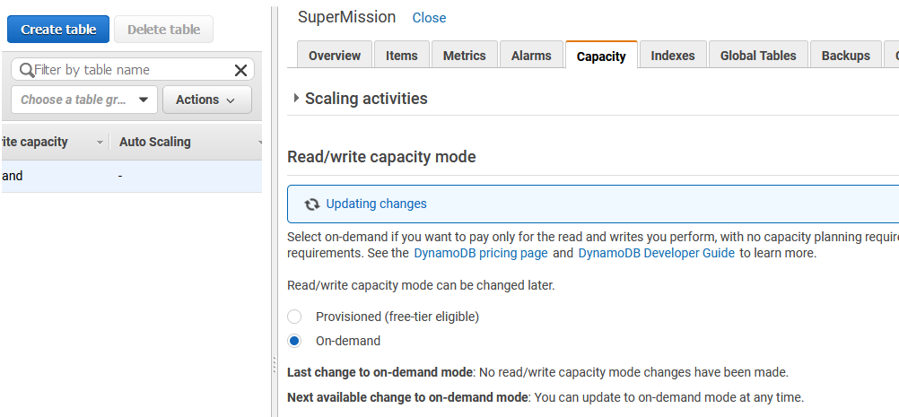
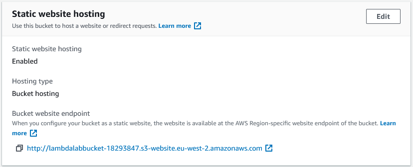

# Creating a serverless web app using AWS lambda and DynamoDB
In this lab you will go through the process of creating a web application that  relies on AWS Lambda functions to interract with a DynamoDB database.

You will be following a lab produced by Qwiklabs, but you will complete them using the log-in credentials provided to you.

The lab consists of 6 parts. The first 3 are providing an introduction to the AWS `Lambda`, `DynamoDB` and `API-Gateway` services and the final part will be bringing these components together.

## Starting the lab
You will be following a Qwiklabs lab and so before you start it is important that you sign up for a Qwiklabs account [here](https://run.qwiklabs.com/users/sign_up)

To start the lab you will need to go to the [Qwiklabs Lab page](https://www.qwiklabs.com/quests/21?catalog_rank=%7B%22rank%22%3A2%2C%22num_filters%22%3A0%2C%22has_search%22%3Atrue%7D&search_id=11538621)

You should be presented with 6 labs which you should complete in order. 

You should be able to follow the Qwiklabs instructions throughout the labs, however there are some areas that differ so ensure to follow this document first in order to catch any slight deviations.

## Creating and using a DynamoDB database
Select the `Introduction to Amazon DynamoDB ` lab and follow through all the tasks from 1-5

You may encounter an error message on task 5 during the table deletion process. Don't worry about it; the table will be deleted for you.

## Creating an AWS Lambda function to interact with an S3 bucket
Select the `Introduction to AWS Lambda` lab and follow through all the tasks from 1-4

This lab assumes that you are set to the Oregon region within AWS for the purposes of importing the code into the lambda function.

Task 2 asks you to upload the code to the lamda file using `upload from S3`. If you have forgotten to set your AWS region correctly, you can download the .zip for the code [here](https://s3-us-west-2.amazonaws.com/us-west-2-aws-training/awsu-spl/spl-88/2.3.15.prod/scripts/CreateThumbnail.zip)

Then you can instead select `upload from .zip file` and select the file you just downloaded (CreateThumbnail.zip).

## Using the AWS API-gateway to create a serverless RESTful api with an AWS Lambda backend
In this lab you will learn how to create RESTful api for an AWS `Lambda` function by using the AWS `API-gateway` framework.

Complete tasks 1-2

## Serverless Web Apps using Amazon DynamoDB - Part 1 

Follow task 1

**Important:** After creating your table in task one, select the `capacity` tab

Change the read/write capacity mode from `provisioned` to `on-demand`

Then click save 

Continue with tasks 2-4

Note in task 4 that the exact JSON for the role policies will not exactly match that of the policies shown in the Lab, however it will not impact you.

## Serverless Web Apps using Amazon DynamoDB - Part 2

For this section of the lab you should ignore task 1 and move straight on to task 2

## Serverless Web Apps using Amazon DynamoDB - Part 3

Complete task 2

Note that on steps 21 and 24 the lab asks you to set the region of your REST api method. Please ensure that you select the region that you have been using throughout the lab as it is **essential** for everything to work together.

Complete tasks 3-4

Note that on step 58 you are asked to paste your bucket name into a pre-determined url. This will not necessarily work as it is region dependent.

A better approach is to select the `properties` tab within your S3 console.

Scroll to the `static website hosting` section 

Click the `bucket website endpoint` URL 

## Finishing up

Congratualations! At this point you have finished the lab. You have successfully created a web application that is hosted on an `S3 bucket` that makes use of a custom API built using `API-Gateway` to serve data from your own `DynamoDB` database.
